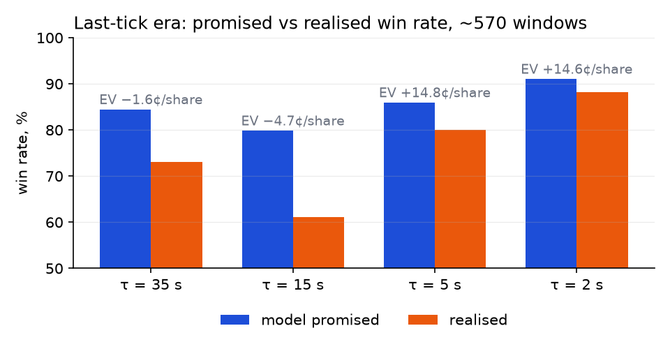
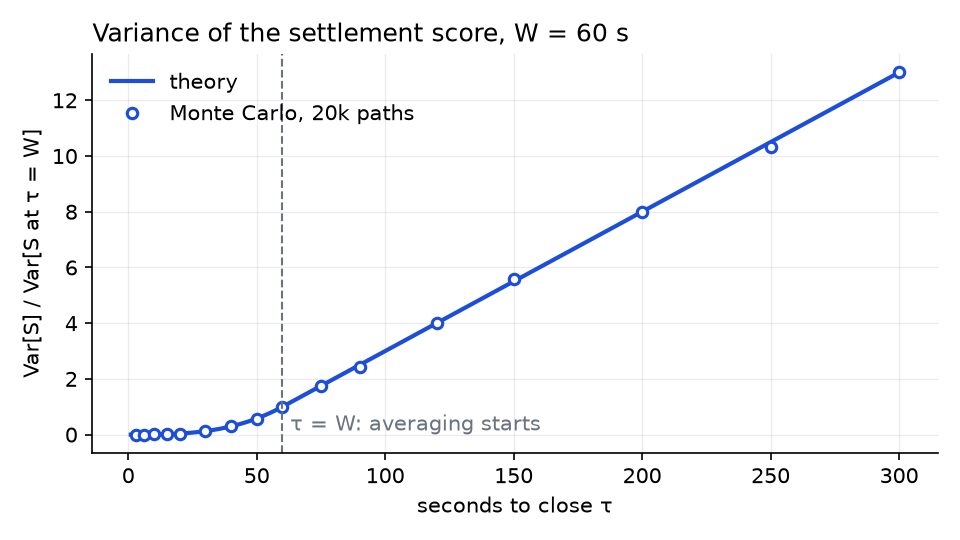
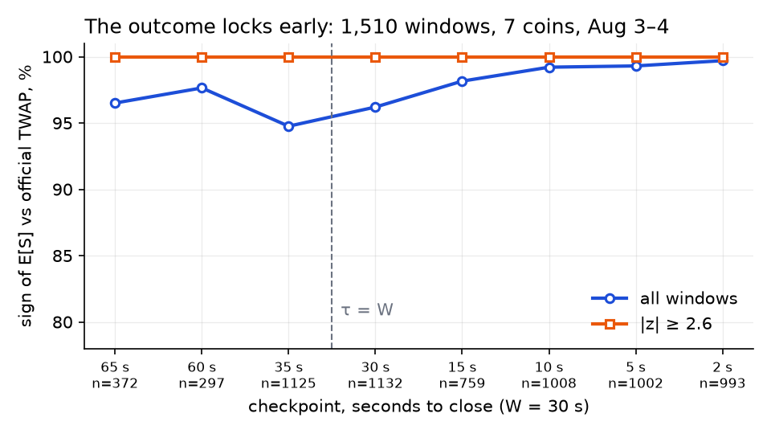
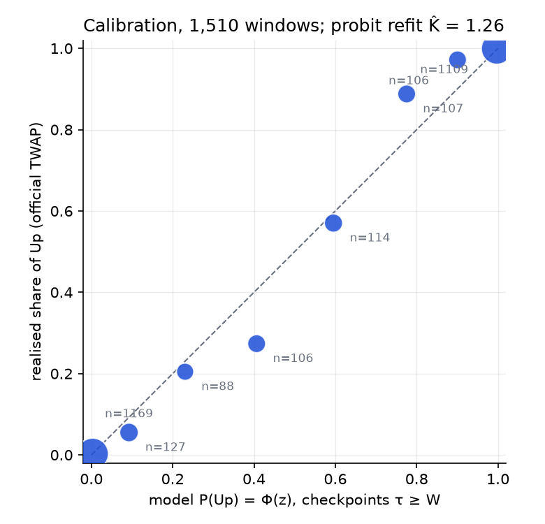
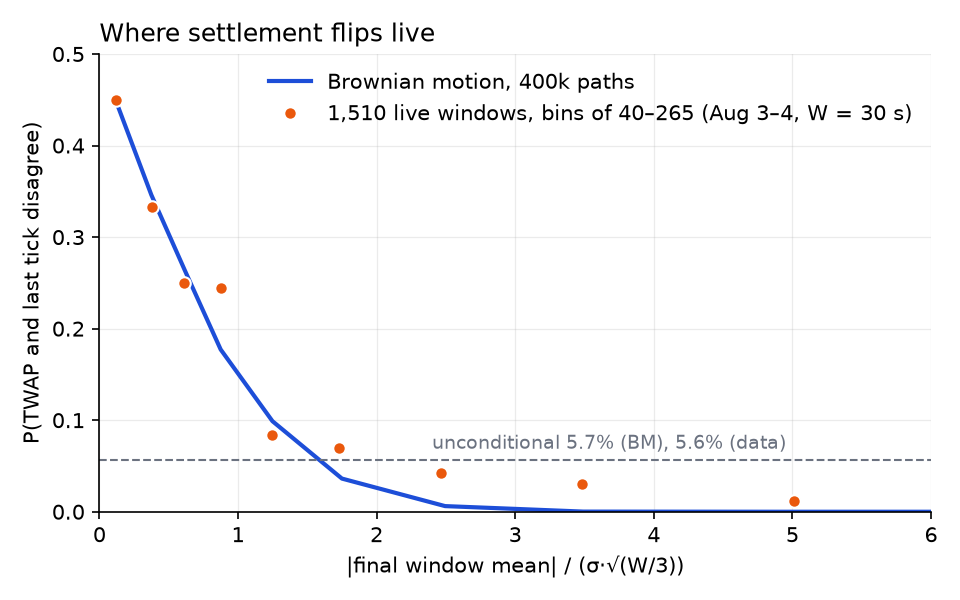
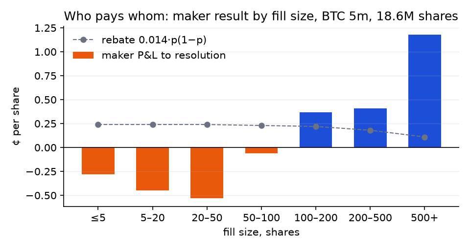
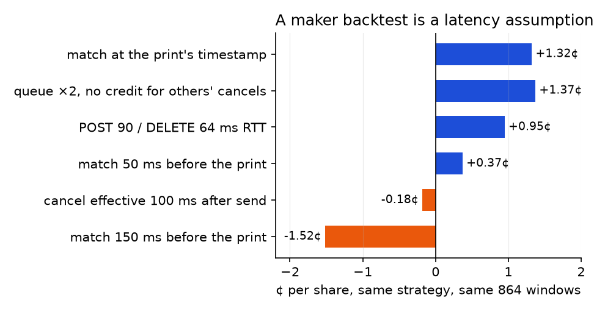

# Polymarket 5-minute crypto markets: notes from three months of bots

Jul–Sep 2026. Seven coins (BTC, ETH, SOL, XRP, DOGE, BNB, HYPE), "Up or Down" markets on 5- and 15-minute windows, settled on Chainlink Data Streams. Two tokens per market, the winner pays \$1. Taker fee 0.07·p(1−p) per share (1.75¢ at p = 0.5); makers get 20% of the fee pool back as a rebate.

In those three months the venue changed the rules under me twice: settlement went from the last oracle tick to a TWAP (Aug 7), and the taker delay went 250 ms → 50 ms → 150 ms. Each change killed one bot and made the next one. This is the write-up: the models, the numbers, and why the retail edge here is structurally small. No trading code, only the math and the measurements. Derivations are in [docs/twap_math.pdf](docs/twap_math.pdf).

## 1. Last-tick era: a taker sniper

Until Aug 7 a market resolved Up if the last Chainlink print at close was ≥ the print at open. The oracle relays exchange prices with ~2 s of lag, so in the last seconds of a window the outcome is often already visible on Binance and Coinbase while the Polymarket book still shows asks from ten seconds ago.

Two takers lived here. The first bought the leading token on a spot jump ($|z| \ge 2$ against the oracle's last print) anywhere in the window. The second waited for the endgame, the last 20 s, and re-evaluated every 50 ms. Its fair value of Up with $\tau$ seconds to close, $\hat m$ the log move from the open print to the current exchange price, $\sigma$ the 1-second volatility (EWMA, half-life 180 s):

$$
\text{fair}_{\text{up}} = \Phi\!\left(\frac{K\,\hat m}{\sqrt{\sigma^2\tau + b^2}}\right),\qquad K = 0.9,\quad b = 1\ \text{bps}
$$

$K$ and $b$ were fitted on 11,183 tape samples against real winners (log-loss 0.146, vs 0.175 without the floor $b$). The floor is what refuses near-tie buys. Buy the favoured token when

$$
\text{fair} - \text{ask} - \text{fee}(\text{ask}) \ge 0.03,\qquad \text{fee}(p) = 0.07\,p\,(1-p)
$$

```python
def fair_up(m, sigma, tau, K=0.9, b=1e-4):
    return phi(K * m / math.sqrt(sigma**2 * tau + b**2))

def fee(p):
    return 0.07 * p * (1 - p)

if fair - ask - fee(ask) >= 0.03:
    fak(token, limit=fair - 0.03)       # fill-and-kill, hold to resolution
```

$\hat m$ is the oracle's last print plus a nowcast of its next one: a ridge basket over seven exchange feeds, refit nightly. Binance carries most of the weight, a few venues enter with small negative weights as noise hedges. Out of sample it predicts the next oracle print about 20% better than the best single feed.

**Adverse selection.** Promised vs realised win rate by time to close, ~570 windows:



An ask resting calmly 15 s before close rests there because its owner is not afraid, and is right more often than a diffusion model expects. Clean EV lived only in the last ~5 s. That is a latency race.

**The race.** First version in Python: median order POST 293 ms, 63% of my fill-and-kill orders killed by a faster taker. What mattered, in order:

- Presign. One EIP-712 signed order per cent of the price ladder, built before the decision. Each has its own salt and is used once. On signal: no signing, no tick-size lookup, one POST.
- Warm connection. A cold TLS handshake to the CLOB costs ~200 ms, a warm request ~20 ms. A GET every 10 s keeps the pool alive. HTTP/1.1, not h2: with h2 every thread multiplexes one connection and a Cloudflare GOAWAY mid-burst kills all queued streams.
- Event-driven decisions: evaluate on every book update and every exchange mid, not on a timer. TCP_NODELAY, two redundant oracle sockets.

```python
# before the window's last seconds: one signed body per price level
for cents in range(90, 100):
    pre[(tok, cents)] = sign_order(tok, price=cents / 100, size=cap / (cents / 100))

# on signal: pop and post, nothing else on the hot path
body = pre.pop((tok, round(limit * 100)))
resp = http.post(CLOB + "/order", data=body, headers=l2_headers(body))
```

After the hot path was rewritten, POST came down to ~22 ms.

**What it earned.** The jump bot's first week, 2,730 resolved positions: fees ate the whole gross, net indistinguishable from zero (t = −0.05). Two structural reasons:

- Winner's curse. Fills swept above the ask I saw: +2.0¢/share. Fills exactly at the ask I saw: −2.7¢/share. Windows where no other taker printed: net loss. Good fills get competed away, you keep the ones nobody else wanted.
- Fee wall. Prices 0.50–0.73 sit at the peak of the fee curve. Gross edge there ~1¢, fee ~1.5¢.

Late entries at 0.9+ in the last 5 s were profitable per share, but there the capacity is the size of one stale ask: single digits of dollars per window.

## 2. TWAP settlement, Aug 7 2026

A Stanford/SMU study (Dai, Jia, Yu, *Settlement Manipulation in Prediction Markets*) found 821 wallets pushing the underlying in the final seconds of 5-minute windows, \$8.2M extracted. One late spike decided the whole settlement, because the settlement was the last tick. Polymarket switched to Chainlink time-weighted averages: 30 s for 5-minute markets, 60 s for 15-minute. A week later (Aug 14) the 5-minute window went to 60 s too.

**The rule.** Two official prints are compared:

$$
\text{Up} \iff \bar P_{\text{close}} \ge \bar P_{\text{open}}
$$

The baseline is itself an average over the $W$ seconds before the window opened, not the spot price at open. The two candidate baselines differ by 0.62 bps median (p90 2.6 bps), the same order as tradable margins. Verified on 1,578 windows: print-vs-print agrees with actual resolutions 98.8% (5m) / 99.7% (15m), a spot-open baseline 93.6% / 96.2%.

The print stamped $T$ covers $[T-W-2,\ T-2]$. Measured by fitting the offset $d$ that minimises the RMSE between my own LOCF integral of the raw ticks and the official values: $d = 2.0$ s, RMSE 0.046 bps.

**Why manipulation dies.** A spike lasting $\delta$ enters the average with weight $\delta/W$. A 1-second push keeps 1/60 of its old power; to move the average you must hold the price for the whole window, and the cost grows linearly in $W$.

**The residual coin flip.** The official print and the actual resolution still disagree on ~0.7% of windows, all at final margins below ~0.15 bps, where which sample the resolver takes decides the outcome. Coin dependent: BNB 1.8%, HYPE 1.2%, DOGE and BTC 0.9%, XRP 0.6%, ETH 0.3%, SOL 0.0%. At ask 0.99 breakeven is a 99.3% win rate, so micro-margin windows cannot be bought high.

### The math

Let $x_s = \ln(P_s/\bar P_{\text{open}})$ follow a driftless Brownian motion with per-second variance $\sigma^2$. Settlement depends on

$$
S = \int_{T-W}^{T} x_s\,ds,\qquad \text{Up} \iff S \ge 0
$$

$S$ is a linear functional of a Gaussian path, so it is exactly Gaussian. With $\tau$ seconds to close, $I$ the part of the integral already observed (LOCF over delivered oracle ticks) and $\hat m$ the nowcast of $x$ now:

$$
\mathbb{E}[S] = \begin{cases} I + \hat m\,\tau, & \tau \le W \\[2pt] \hat m\,W, & \tau > W \end{cases}
\qquad\qquad
\operatorname{Var}[S] = \begin{cases} \sigma^2\tau^3/3, & \tau \le W \\[2pt] W^2\sigma^2\,(\tau - \tfrac{2W}{3}), & \tau > W \end{cases}
$$

The first branch is the Asian-option variance $\operatorname{Var}\!\left[\int_0^\tau B_u\,du\right] = \sigma^2\tau^3/3$; the second is the forward-starting case, a common shift over $\tau - W$ plus the in-window averaging. Both meet at $\tau = W$. Monte Carlo ratio to theory: 0.993 and 0.994.



Inside the window uncertainty dies cubically: at $\tau = W/2$ only 12.5% of the full-window variance remains, at $\tau = 3$ s of a 60-s window 0.01%. The outcome locks long before the close. In the journal it looks like this: 1,510 windows over Aug 3–4 (the official prints streamed from Aug 4, W = 30 s), seven coins, the sign of $\mathbb{E}[S]$ against the official print at fixed checkpoints:



At $|z| \ge 2.6$ the sign was never wrong at any checkpoint, from 65 s out down to 2 s. Every error sits in the small-z windows, where the book is priced near 0.5 anyway.

$$
\text{fair}_{\text{up}} = \Phi\!\left(\frac{\mathbb{E}[S]}{\sqrt{\operatorname{Var}[S] + \big(b\cdot\max(\min(\tau,W),\,3)\big)^2 + (b_I\,W)^2}}\right),\qquad b = 0.3\ \text{bps},\quad b_I = 0.05\ \text{bps}
$$

The noise term follows how each error enters the score: the nowcast error $b$ enters with weight $\tau$ (capped at $W$), the integral's own error $b_I$ is the measured print-reconstruction noise over the whole window. A constant floor $b\cdot W$ mispriced both ends of the window, too loose early and blind to genuinely locked windows late. Journal replay of 25,549 snapshots at the same 5¢ margin: the τ-scaled floor moved entries into the late zone (5–20 s: 42 → 67 entries, win rate 0.56–0.64 → 0.72–0.73), total 412 → 437 entries at 71.1% → 72.8%.

Calibration of the raw $\Phi(z)$ on the same 1,510 windows, checkpoints at $\tau \ge W$:



The model is under-confident in the middle: a probit refit gives $\hat K = 1.26$ on all windows and 1.22 on the 302 held-out ones (Brier 0.0264 vs 0.0280 at $K = 1$). Consistent with the trending tape at 1-second horizons (section 3). I kept $K = 1$ in the bot and let the margin absorb it.

```python
def twap_e_var(i_acc, m, tau, W, var):
    if tau <= W:
        return i_acc + m * tau, var * tau**3 / 3
    return m * W, W**2 * var * (tau - 2 * W / 3)

def locf_integral(ticks, open_px, t_from, t_to):
    """ticks: (payload_ts, px) by payload time; x holds until the next tick."""
    x, t, acc = None, t_from, 0.0
    for ts, px in ticks:
        if ts < t_from:
            x = math.log(px / open_px); continue
        if ts > t_to:
            break
        if x is not None:
            acc += x * (ts - t)
        x, t = math.log(px / open_px), ts
    return acc + x * (t_to - t)
```

**Fat tails, two guards.** 1-second crypto returns are Student-t with ~4 degrees of freedom, so $\Phi$ overstates certainty at high $z$. Measured on 1,100+ live windows: at $\tau \in [30, 35]$ s even $|z| \ge 7$ realised only 98.4%. A reversing jump arrives with an intensity that does not care about $z$, so in the locked phase

$$
\text{fair} \le 1 - \lambda_{\text{flip}}\,\tau,\qquad \lambda^{5m}_{\text{flip}} = 5.3\times10^{-4}\ \text{s}^{-1}\ \text{(measured)}
$$

And $\sigma$ itself: one jump sits in an $r^2$-EWMA for the rest of the window and blinds the bot to honest entries after every spike. Bipower kernel instead (Barndorff-Nielsen–Shephard), unbiased for the diffusive part, a jump enters linearly:

$$
v \leftarrow (1-a)\,v + a\cdot\tfrac{\pi}{2}\,|u_t|\,|u_{t-1}|,\qquad u_t = |r_t|/\sqrt{dt},\quad a = 1 - 2^{-dt/180}
$$

Unit test: a 50σ jump inflates the $r^2$-EWMA 85×, the bipower one 7.8×, decaying within seconds.

**Flip probability, closed form.** The strike is the open print and the settlement mean runs over the last $W$ seconds of a $T$-second window. For Brownian motion the window mean $M$ and the endpoint $X$ are jointly Gaussian with

$$
\rho = \operatorname{corr}(M, X) = \frac{T - W/2}{\sqrt{T\,(T - 2W/3)}},\qquad P(\text{TWAP} \ne \text{last tick}) = \frac{\arccos\rho}{\pi}
$$

With $T = 300$: 5.8% at $W = 30$, 8.2% at $W = 60$. The limit $W = T$ gives the textbook $\arccos(\sqrt3/2)/\pi = 1/6$; the PDF quotes that limit, and it is the wrong regime for this market. Measured on the 1,510 windows above ($W = 30$): 5.6%. Conditional on the final margin the flips sit where the mean is small. The data follow the Brownian curve up to about two standard deviations and sit above it beyond: 4% of flips at z ≈ 2.5, 3% at 3.5, 1% at 5, where a diffusion gives none. That tail is a reversing jump, and it is what the jump cap above is for:



```python
import numpy as np
T, W = 300, 30
b = np.cumsum(np.random.standard_normal((400_000, T)), axis=1)      # 1 s steps
flip = np.sign(b[:, -W:].mean(axis=1)) != np.sign(b[:, -1])
print(flip.mean())                                                    # 0.057; W = T gives 1/6
```

**Where the edge went.** Zones of a 5-minute window, ~1,100 live windows (sign of the projected mean vs actual resolution):

| zone | measured accuracy | comment |
|---|---|---|
| τ > W, pure forecast | ≤ 98.5% even at \|z\| ≥ 7 | fat tails; only with fat margins |
| τ ∈ (W/2, W], integral forming | ~99% at \|z\| ≥ 2.6 | a 5¢ margin absorbs the ~6 pp adverse-selection gap |
| τ ∈ [3, W/2], locked | 100.00% at \|z\| ≥ 2.6, 708–810 windows | collect stale asks 0.94–0.99 |
| τ < 3 s | resolver dead band | do not enter |

The locked phase is near-riskless and everyone can see it. Winner-side asks in 0.94–0.99 are present in 38% of windows at τ = W, 14% at W/2, 7% at 5 s, a few dollars each. The sniper kept a 100% win rate and stopped mattering. Under last-tick rules the model had information the book did not; under TWAP the book has the same integral.

One execution lesson from this phase. A fill-and-kill limit derived from the model alone, fair − margin, authorises buying everything up to ~0.94. When the displayed ask is dust on a hollow book the order sweeps the void: live fills at 0.51 against a seen ask of 0.05 (DOGE) and 0.71 against 0.12 (HYPE). A hollow book is the maximal adverse-selection state and no decision-time probability sees it, so the guard lives in execution: limit = min(fair − margin, ask + 3¢, p_max). It costs nothing on honest fills and turns sweeps into misses.

## 3. The flip catcher

The same model, used the other way round. When the favourite trades at 0.98+ but the model still gives the underdog 0.45 or more, buy the underdog at 1–5¢ with a taker order and hold to resolution. The market's 0.99 reverses in 0.71% of windows, so unconditional buying loses (implied 1%). The model has to pick the right 1%.

Projection with a trend term. $K$ is the official open print. $E$ is the mean of the closing 60 s: delivered oracle ticks are taken as they are; undelivered seconds are projected from Binance shifted by the oracle lag $L$, scaled by the level ratio $\rho$ (median oracle/Binance over 120 s), plus the Binance slope of the last 30 s saturating at 60 s. The oracle trails Binance by ~1.65 s, and the tape at these horizons is sub-diffusive and trending ($r(1\text{ s}) \approx +0.3$), which the flat projection missed.

```python
def p_up_trend(K, cl, bn, now, close, rho, sigma, slope,
               W=60, L=1.0, cl_lag=1.65, H=60, kappa=1.1):
    vals, dd = [], []
    for u in range(close - W + 1, close + 1):
        if u in cl and u <= now - cl_lag + 0.5:          # oracle tick already in
            vals.append(cl[u]); dd.append(0.0)
        else:                                            # project from Binance
            h = max(u - L - now, 0.0)
            vals.append(rho * (bn.at(min(u - L, now)) + slope * min(h, H)))
            dd.append(h)
    E = sum(vals) / W
    ds = sorted(dd)                                      # Var of a sum of BM values
    sd = sigma * rho * bn.at(now) * math.sqrt(sum(d * (2 * (W - i) - 1)
                                                  for i, d in enumerate(ds))) / W
    return phi((E - K) / (kappa * sd))
```

What made it work, all found on tape before going live:

- Dollar sizing. Counted per share, the pocket $P_u \ge 0.2$ looked like +4.3¢/share at t = 1.6. Counted per dollar it is +178% (train) / +537% (test). The convexity of a 2¢ entry is the edge, so the stake must be in dollars.
- Trend in the projection: 120 entries per 4 days, take-profit rate 24%, stable across halves, days and all seven coins.
- No dwell. Holding the signal 2 s before firing: 24 caught flips → 10; 4 s → 6. The flicker of $P_u$ around the threshold is the signal itself. The flip is born in a fight at the strike.
- Calibration is honest only in τ ∈ [220, 280] s. At τ 180–210 the model said 0.98 and realised 0.86; past 280 s it said 0.99 and realised 0.74, racing against fresher data.
- $P_u \ge 0.8$ live: 0 wins in 27 positions. The live model on raw ticks overheats where the replay did not. Cap at 0.8.

Live, Aug 22 to Sep 6: 3% of positions win against a 0.71% base rate, a win pays 20–100× the stake, positive every week. Capacity \$2–5 per shot, because depth at 1–5¢ is ~50 shares. Then it faded. Sep 7–12: 245 positions, 4 wins. The signal was alive (the probe log hit 50 winning underdogs in 12 days; the tape shows ~12 flips of a 0.98 favourite per day), the capture fell from 53% to 10%. In 68% of the misses the cheap ask was pulled 0.08 s (median) before my order would have matched, i.e. during the venue's hold. What was mine in August was being taken by someone faster in September, or the makers had learned to pull.

Execution fixes tried: a presigned grid of 3–5¢ orders per window, a chase every 0.25 s while the signal lives, limit = ask + 2¢. A resting maker bid at 2¢ instead of the taker order: negative, it fills on 7 of 42 winners.

## 4. The taker delay

Polymarket holds a marketable order on crypto markets for a fixed delay before matching, re-validates it, and lets resting makers cancel inside the hold. I found it the hard way: POST round trips of 283 ms (kill) and 366 ms (fill) on a connection whose warm GET takes 20 ms. It is documented in the order lifecycle, not in the latency.

| date | taker delay | |
|---|---:|---|
| until Aug 17 | 250 ms | a maker can pull a quote on a Binance move while the taker's order waits |
| Aug 17 | 50 ms | volume fell |
| Sep 4 | 150 ms | current |

At 250 ms speed is not a taker's lever: 5–10 ms can be squeezed out of 283. The model has to predict the book at t + 0.25 s. For makers 250 ms was a gift, and that is where I went next.

## 5. Market making at 150 ms

Rebate: 20% of the fee pool per market per day, pro rata to fill fees, i.e. 0.014·p(1−p) \$/share, 0.35¢ at p = 0.5. BTC 5m turns over ~\$40M a week, rebate pool ~\$25k a day. The plan: post-only quotes on both tokens around a fair, hedged into pairs (Up + Down for less than \$1), live on the rebate.

**Infrastructure.** A recorder on EC2 into TimescaleDB: Polymarket L2 book and prints for both tokens, Binance bookTicker and trades, Chainlink ticks and TWAP prints. 155M rows a day, 24.6× compression. Later a 17-venue L2 collector (spot and perp books) for a cross-venue oracle, ~1.7 GB a day compressed. One C++ engine shared between replay, shadow and live; an execution simulator with a FIFO queue, post-only rejection at arrival, cancel effective vs acknowledged, late fill reports and the taker hold.

**What the tape says about makers.** Every print is someone's fill. Maker P&L to resolution, BTC 5m, 2,588 windows, 113M shares: +0.08¢/share trading, +0.20¢ rebate, +0.275¢ net [95%: +0.15, +0.40]. The average maker earns. Mine: −0.48¢. By fill size (data-api, 310 windows, 18.6M shares):



Small fills are the toxic ones. The takers in profit after fees are bots with 8–75 share clips reacting to the 1-second Binance flow; the big takers lose 3–7¢/share, and that is who the large makers eat. A 5-share maker is the counterparty of choice for the Binance-lag bots.

**The cancel race.** Timing on 168 windows of prints plus my own journal:

- The level in the book shrinks 95–210 ms (p50 by day) before the trade's print arrives. The print is a late report of a match that already happened.
- 89% of my fills were on orders I had already decided to cancel. Venue match: 66 ms (median) after my decision. My decision → cancelled: 69 ms. Lost by ~30 ms, every time.
- Fills after an adverse Binance move in the prior 3 s: −1.32¢/share. Without one: +0.93¢. After a favourable one: +3.57¢. The gates worked on average; the whole loss was the 3% tail right after a sharp adverse move.
- Pair cost live 1.02–1.035, for a pair that must cost under 1 − rebate.

At 250 ms a maker had a quarter of a second to pull after a Binance move, which is what the delay was for. At 150 ms, with a cancel path of 68 ms (38 ms after cancelling by order hash before the POST ack), the race is lost from Dublin without queue priority.

**Why I could not backtest it.** Three rounds of reconciling the replay with live fills, three findings, each one in the replay's favour:

1. The queue. The replay gave my order the whole volume of a print that swept through its level, ahead of everyone resting there. Fill count came out 2.7× live; the queue parameter was inert.
2. The criterion. Configs were selected by 10-second markout plus a flat rebate. Markout at τ = 60 is biased +1.25¢/share by the very adverse selection being measured, and the rebate is 0.11¢ in the wings, not 0.26. Re-scored to resolution, the winner changed and lost.
3. Selection noise. A grid of 243 configs over 600 windows: the winner on a random half scores −0.32¢/share on the other half, against a median of −0.38 for all configs. Of a +0.77 training advantage, +0.06 [95%: −1.03, +0.91] carries over. The whole grid sits at −0.36 ± 0.37.

And the stress test that ends it, one fixed candidate on the same 864 windows under different assumptions about when the match happened:



Shift the assumed match 150 ms before the print and +1.32¢/share becomes −1.52¢, t = −10.8. The sign of a maker backtest is decided by a 150-ms assumption about when the match happened, and the public tape does not contain it. Taker replays on the same tape reproduced live results (the flip catcher's replay matched its own journal). The maker replay matched live only after fitting two unobservable latencies to live fill counters, and the fit did not hold on a holdout.

**What held: the oracle-gated maker.** The one version with a positive result is the one running now. Same clip-5 quoter, plus a cross-venue oracle inside the process: L2 books and quotes from Binance (spot and perp), Bybit, OKX and Deribit, 36 features (price lags at 0.25 / 0.75 / 3 s, book imbalance at 1 / 5 / 20 levels, microprice, slope, order-flow imbalance over 1 and 5 s), a ridge fit on 60 h of tape predicting the Up-token mid 0.5 s ahead. One rule on top of the quoter: do not bid on the token the oracle says is about to move down. Nothing else changed.

Forward test, Sep 11–14, 575 windows, 7.6k shares: +2.3¢/share net of rebate, t = 2.6 by window. The decomposition is the point:

- Pairs still cost 1.03 on average. The two-sided business loses, as it does for every small maker on this book.
- The naked leg wins 62.8% at an average price of 56.8¢: +6.0 pp over what it pays, t = 3.6. Favourite legs (price ≥ 0.6) win 90% at 77.5¢; underdog legs (< 0.45) win 16% at 21¢ and lose money.

That is adverse selection neutralised on the leg: the fills the gate lets through are not the toxic ones. On the next clip-5 series (Sep 18–21, 725 windows) the leg still won 60% at 56¢ while the net was flat, the pairs ate it.

Everything that tried to make it bigger made it worse and was rolled back:

- Size ×2 (clip 10): 251 windows at −0.76¢/share, pair cost 1.031 → 1.047. μ and σ scale together and t does not move; size does not buy statistics.
- Pair-cost cap at 1.00: pairs at 0.81, leg win rate 60% → 38.5% (z = −2.7). The cap moves EV from the leg into the pairs, net zero.
- Earlier cancels by order hash (68 → 38 ms), pre-open quoting, ladders, dumping the leg with a taker order at 60 s: a day in the red, all of it.

What runs now is the Sep 16 build with clip 5. Its volume is 0.02% of the BTC market, and a t of 2.6 needs about 900 windows to become 3.

**Also tried, also falsified.** Book walls as price support: P(price passes the level within 10 s) ≈ 0.5 for every size bucket, 48 windows. The price-only version of the cross-venue signal: real, Binance perp predicts the Up-token mid 0.5 s ahead at +1.25¢ with t = 28.6 (Hyperliquid as control: +0.12), but for my fills a gate on it is worth +0.05¢/share [−0.22, +0.32]; every 100 ms of lead costs 0.07¢ and at 0.5 s it is zero. The book-depth features are what carried over. Holding through gate flicker, quoting only into growing levels, online ridge refits: none survive a holdout.

## 6. What I take from it

- The market was efficient wherever it could be measured. Every clean edge was small: a few dollars of stale liquidity for the takers, 0.02% of the market for the maker, and most of them lasted weeks.
- The venue's clock beats the model. Settlement rule and taker delay changed three times; each change moved the edge between takers and makers wholesale.
- A backtest of passive execution needs the matching engine's clock. Without it the sign is an assumption.
- Negative results with a clear cause were worth more than the positive ones. The positive ones stopped; the causes did not.

## Files

- `docs/twap_math.pdf`: derivations, calibration and the zone map of the TWAP model.
- `figures/`: the charts above. Monte Carlo ones come from the snippets in the text, the journal ones from 1,510 windows of Aug 3–4, the maker ones from the tape reports.
